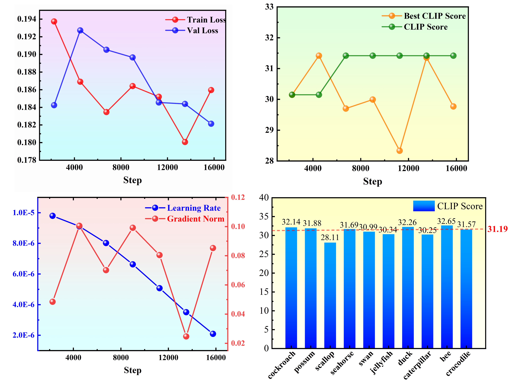

# **100类动物图像生成器**


[](https://doi.org/10.57760/sciencedb.29221)
[](https://lora-alliance.org/)
[](https://stabilitycn.com/)
[](https://www.mit.edu/)
---

## 📋目录

- 🌟[项目介绍](#项目介绍)
- 📊[数据集说明](#数据集说明)
- 📁[文件夹结构](#文件夹结构)
- 🧠[模型架构实现](#模型架构实现)
- 🚀[快速开始](#快速开始)
- 📈[结果展示](#结果展示)

---

## 项目介绍

这是一个基于Stable Diffusion和LoRA技术的动物图像生成系统，能够通过文本描述生成高质量的动物图像，包含完整的训练流程和用户友好的图形界面，支持自定义参数调整和实时图像生成。

### 主要特性

- **高效训练**: 使用LoRA (Low-Rank Adaptation) 技术对Stable Diffusion模型进行轻量级微调
- **用户友好界面**: 基于PyQt5的图形界面，支持实时参数调整和图像预览
- **高质量生成**: 经过优化的生成流程，支持色彩校正和后处理
- **跨平台支持**: 支持CPU和GPU运行环境

## 数据集说明

本项目使用的动物数据集包含 100 个不同类别的动物图片，因为使用网页图片提取下载，清洗由我一个人完全进行，数据集数据量较大，所以部分动物文件夹存在1%-1.5%的噪声图片，数据集组织结构如下：

*   总类别数：100 种动物

*   数据划分：采用 80% 作为训练集，20% 作为验证集

*   图片格式：支持常见图片格式（.jpg, .jpeg, .png 等）

在模型训练过程中，通过数据增强技术扩充了训练样本，包括旋转、平移、缩放、亮度调整等操作，以提高模型的泛化能力。

动物的类别信息请查看`class.txt`

数据集下载：[100种动物识别数据集(ScienceDB)](https://doi.org/10.57760/sciencedb.29221)

### 引用

==如果您使用了本项目的数据集，请使用如下方式进行引用：==

```
Haojing ZHOU. 100种动物识别数据集[DS/OL]. V1. Science Data Bank, 2025[2025-08-30]. https://cstr.cn/31253.11.sciencedb.29221. CSTR:31253.11.sciencedb.29221.
```

或

```
@misc{动物识别,
  author = {Haojing ZHOU},
  title  = {100种动物识别数据集},
  year   = {2025},
  doi    = {10.57760/sciencedb.29221},
  url    = {https://doi.org/10.57760/sciencedb.29221},
  note   = {CSTR: 31253.11.sciencedb.29221},
  publisher = {ScienceDB}
}
```

数据集类别和数量信息展示如下：


### 数据预处理

- 图像分辨率：可配置（默认<kbd>$256×256$</kbd>）
- 中心裁剪：保持图像主体
- 归一化：将像素值从<kbd>$\textbf{[0,255]}$</kbd>转换为<kbd>$\textbf{[-1,1]}$</kbd>
- 文本提示词增强：使用多种模板生成描述文本


## 文件夹目录

```makefile
Animals_Creation/
├── README.md
├── demo.gif      # 演示动画
├── demo.mp4      # 演示视频
├── demo.py       # 主演示脚本
├── icons/        # 图标资源目录
├── train.py
├── log/          # 日志目录
├── model/
    └── LCM-runwayml-stable-diffusion-v1-5/  # Stable Diffusion模型
        ├── feature_extractor/               # 特征提取器
        ├── model_index.json                 # 模型索引文件
        ├── safety_checker/                  # 安全检查器
        ├── scheduler/                       # 调度器
        ├── text_encoder/                    # 文本编码器
        ├── tokenizer/                       # 分词器
        ├── unet/                            # UNet模型
        └── vae/                             # 变分自编码器
├── output/
    ├── evaluation_results.xlsx  # 评估结果Excel文件
    ├── lora_models/  # LoRA模型权重
        └── clip-31.475.safetensors
    ├── training_history.xlsx  # 训练历史记录
    └── pic/
└── requirements.txt
```


## 模型架构实现

### 1. 基础模型：Stable Diffusion v1.5

本项目基于RunwayML的Stable Diffusion v1.5模型，包含以下核心组件：

#### 1.1 Variational Autoencoder (VAE)

- **功能**: 将图像编码到潜在空间，降低计算复杂度
- **编码**: 将 512×512 图像压缩为 64×64×4 的潜在表示
- **解码**: 将潜在表示重建为原始分辨率图像
- **缩放因子**:$0.18215$ （标准VAE缩放比例）

#### 1.2 UNet噪声预测器

- **架构**: 基于 U-Net 的条件扩散模型
- **输入**: 噪声潜在表示 + 时间步嵌入 + 文本条件
- **输出**: 预测的噪声残差
- **条件机制**: 通过交叉注意力融合文本信息

#### 1.3 CLIP文本编码器

- **功能**: 将文本提示词转换为语义嵌入向量
- **输出维度**: 77×768（最大长度77个token）
- **预训练模型**: $OpenAICLIP-ViT-Base$

### 2. LoRA微调技术

#### 2.1 LoRA原理

LoRA (Low-Rank Adaptation) 通过低秩分解来近似权重更新：
$$
ΔW = BA \\
\\
其中:W ∈ R^{d×k}, B ∈ R^{d×r}, A ∈ R^{r×k}, r ≪ min(d,k)
$$

#### 2.2 实现细节

- **目标模块**: UNet 中的 QKV 投影层（$to_q$, $to_k$, $to_v$, $to_{out}$）
- **秩(rank)**: 可配置（默认2）
- **Alpha值**: 可配置（默认16）
- **缩放因子**: alpha/rank
- **Dropout**: 0.0（无丢弃）

#### 2.3 参数效率

- 仅训练LoRA参数，冻结原始模型权重
- 大幅减少可训练参数数量（通常<1%）
- 保持原始模型性能的同时适应特定领域


## 快速开始

### 环境要求

```
Python >= 3.9
PyTorch >= 1.12
CUDA >= 11.3 (GPU版本)
```

### 安装依赖 (注意此处为windows本地CPU运行demo.py环境，训练环境可参考Kaggle GPU P100)

```bash
pip install -r requirements.txt
```

### 训练模型

1. 准备数据集并按种类分文件夹组织
2. 修改配置参数（如数据路径、训练参数）
3. 运行训练脚本：

```bash
python train.py
```

### 使用UI界面

1. 确保已训练好LoRA模型
2. 准备基础Stable Diffusion模型
3. 运行UI应用：

```bash
python demo.py
```

### 界面操作指南

1. **模型设置**:
   - 选择LoRA模型文件(.safetensors)
   - 设置基础模型路径
   - 选择运行设备(CPU/GPU)
2. **生成参数**:
   - 输入动物英文名称
   - 调整推理步数(20-100)
   - 设置引导尺度(1.0-20.0)
3. **色彩调整**:
   - 对比度: 增强图像明暗对比
   - 饱和度: 调整颜色鲜艳程度
   - 亮度: 控制整体照明水平
4. **生成与保存**:
   - 点击"生成图像"开始生成
   - 使用"保存图像"导出结果

界面效果展示：


## 结果展示

### 训练指标

- **训练损失**: 随epoch下降的MSE损失
- **验证损失**: 评估模型泛化能力
- **CLIP分数**: 衡量生成图像与文本的匹配程度
- **学习率LR**：随训练而递减
- **梯度范数GN**：衡量参数更新规模



### 推理时间

| 推理步数 | 推理平均时间（CPU） | 平均总时间 |
| :------: | :-----------------: | :--------: |
|    20    |       68.64s        |  456.65s   |
|   100    |       349.35s       |  823.45s   |
|   200    |       683.96s       |  1209.65s  |
|   400    |      1356.86s       |  1863.25s  |


### 生成示例

系统能够生成多种动物的高质量图像，包括：

- 狮子、老虎、大象等大型动物
- 猫、狗等常见宠物
- 鸟类、鱼类等各种动物类别


更多验证输出样例可见`output/pic`

使用不同推理步数得到的`tiger`图像如下所示：


UI界面的使用实例如下：


